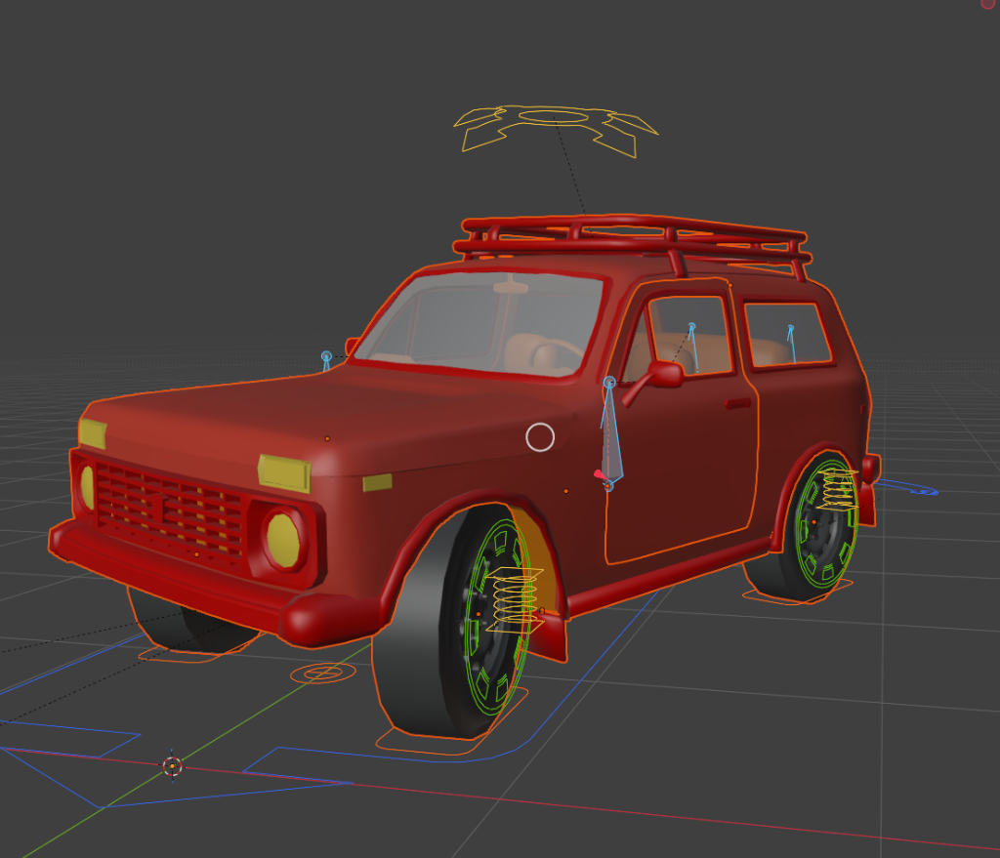
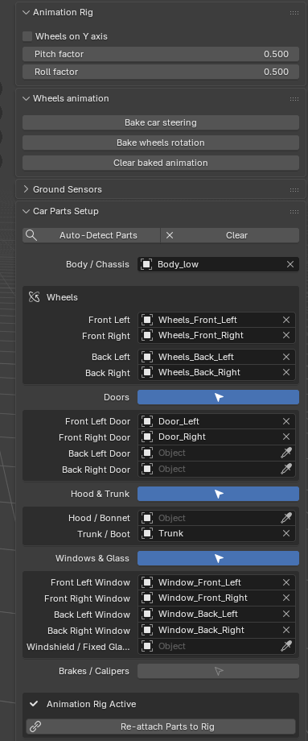

# Rigacar (Blender 4.2 – 5.1+ Edition)

  

A maintained, enhanced fork of **Rigacar** updated and optimized for **Blender 4.2, 5.0, and 5.1+**.

Rigacar quickly generates complete vehicle animation rigs with automated wheel rotation, suspension dynamics, ground projection, and animation baking.

---

## 🚀 What's New in this Edition

  

* **Full Blender 5.1+ Compatibility:**
  * Updated to use Blender's new **Slotted Actions / `ActionChannelbag` API** (legacy `action.fcurves` deprecation fix).
  * Migrated from legacy layers to **Bone Collections** (`CarRig_Default_Ctrls`, `CarRig_Def_Bone`, etc.).
  * Validated for Blender's new **Extensions Manager** (`blender_manifest.toml`).
* **Interactive Car Parts Setup (N-Panel):**
  * Dedicated **Car Parts Setup** view in the 3D Viewport sidebar (**Rigacar** tab).
  * **Auto-Detect Parts:** Intelligently matches Body, 4 Wheels, Brakes, Doors, Trunk, Hood, and Windows from selected or scene objects.
  * **One-Click Rig Generation & Snapping:** Perfectly scales and positions bone hierarchies to match your chosen 3D meshes with zero guesswork.
* **Interactive Doors, Windows, Trunk & Hood:**
  * **Door Hinge Rigging:** Automatic detection of door hinge pivots (prioritizing custom mesh origins and calculating front door seams without side-mirror distortion).
  * **Dedicated Window Bones:** Window panes get dedicated animatable bones parented to their doors (`Window.Ft.L` -> `Door.Ft.L`), allowing realistic roll-down animation inside the door frame while swinging open together with the door.
  * **Trunk & Hood:** Horizontal hinge bones for hoods and tailgates.
* **Preserved Transform Safety:**
  * Re-snapping or modifying bones safely preserves world matrices, preventing parented meshes from drifting or jumping.

---

## 🎯 How to Prepare Car Parts & Set Pivots for Best Results

Setting up your mesh origins (pivot points) properly ensures the generated bones align exactly with physical hinges and wheel axles:

### 1. Apply Transforms First (Rule #1)
Before rigging, select all vehicle mesh parts, press **`Ctrl + A`** and select **`Apply All Transforms`** (or at least *Rotation & Scale*).
* Ensures all objects have a uniform scale of `(1.0, 1.0, 1.0)`.
* Prevents skewed bones or inverted rotation directions.

### 2. Door Hinge Pivots (Opening Doors)
Car doors swing open around their vertical hinge line near the front A-pillar:
* **Recommended (Exact Pivot):**
  1. Select the door mesh and press **`Tab`** to enter **Edit Mode**.
  2. Select the front vertex or vertical edge on the front seam where the door hinge attaches to the body.
  3. Press **`Shift + S` → `Cursor to Selected`**.
  4. Press **`Tab`** to return to **Object Mode**.
  5. Right-click the door mesh and choose **`Set Origin` → `Origin to 3D Cursor`**.
* **Automatic Detection:** If you keep the origin at `(0, 0, 0)`, Rigacar will automatically detect the front door seam vertices and position the vertical hinge bone there without getting pulled outwards by rearview mirrors or door handles.

### 3. Wheels (Rotation Axle Pivot)
Wheels must rotate cleanly around their exact cylindrical center:
1. Select each wheel mesh in **Object Mode**.
2. Right-click → **`Set Origin` → `Origin to Center of Mass (Surface)`** (or **`Origin to Geometry`**).
3. Rigacar automatically snaps wheel bones to this exact center and calculates the wheel radius from the mesh dimensions.

### 4. Windows & Glass (Roll-Down Animation)
* Separate each movable window pane into its own mesh object.
* You can keep the origin at the window geometry center or bottom edge.
* Rigacar automatically creates a dedicated bone at the lower sill of the window glass, parented to the door bone. In Pose Mode, translating the window bone along local Z rolls the glass smoothly down into the door slot.

### 5. Trunk / Tailgate & Hood / Bonnet
* **Trunk / Boot:** Hinges horizontally along the top seam. In Edit Mode, place the 3D Cursor at the top edge connecting the trunk to the roof, then **Set Origin → Origin to 3D Cursor**. Rotating the bone along X opens the trunk upwards.
* **Hood / Bonnet:** Hinges horizontally along the rear seam near the windshield base. Set the origin along that rear edge.

---

## 📦 Installation

### Option A: Install from Zip (Blender 4.2 / 5.x)
1. Download **`rigacar-1.0.4.zip`** from the [Releases](https://github.com/lukaiaa/rigacar-Blender-5.0-/releases) page.
2. In Blender, go to **Edit → Preferences → Add-ons / Extensions**.
3. Click the dropdown menu in the upper-right corner (arrow icon) and choose **Install from Disk...**.
4. Select `rigacar-1.0.4.zip` and enable **Rigacar**.

---

## 🛠️ Quick Start Guide

1. Open the 3D Viewport sidebar (press `N`) and click the **Rigacar** tab.
2. Under **Car Parts Setup**:
   * Click **Auto-Detect Parts** (or assign your meshes using the eyedroppers).
   * Toggle **Doors**, **Hood & Trunk**, or **Windows & Glass** if your vehicle has separate parts.
3. Click **Create Rig from Chosen Parts** (or **Snap Bones to Chosen Parts** if you already added a deformation rig).
4. Click **Attach Parts to Rig** to parent all meshes with preserved world positions.
5. Click **Generate Animation Rig**.
6. Switch to **Pose Mode** to animate:
   * Move the **Root** bone to drive the vehicle.
   * Rotate **Door.Ft.L** / **Door.Ft.R** along Z to open doors.
   * Move **Window.Ft.L** / **Window.Ft.R** along Z to roll down windows.
   * Rotate **Trunk** / **Hood** along X to open.
   * In the Rigacar panel, click **Bake wheels rotation** to bake automatic wheel spinning.

---

## 🎮 Exporting to Game Engines (Unity / Unreal Engine)

1. Select your car meshes and armature.
2. Go to **File → Export → FBX (.fbx)**.
3. In the export settings:
   * **Include:** Check *Selected Objects*, select *Armature* and *Mesh*.
   * **Armature:**
     * ✅ Check **Only Deform Bones** (strips out control widgets, leaving only the clean deform skeleton).
     * ❌ Uncheck **Add Leaf Bones** (prevents unnecessary `_end` dummy bones).
   * **Animation:**
     * If playing animations in Unity/Unreal, bake the action first via **Pose → Animation → Bake Action...** (enable *Visual Keying*) since game engines do not execute Blender constraints.
     * If using game engine vehicle physics (e.g. Unity `WheelCollider`), export in default rest pose without animation.

---

## 📜 Credits & License

* Originally created by **David Gayerie** ([digicreatures.net](http://digicreatures.net/articles/rigacar.html)).
* Maintained and extended by the community under the **GNU General Public License v3 (GPL-3.0)**.
